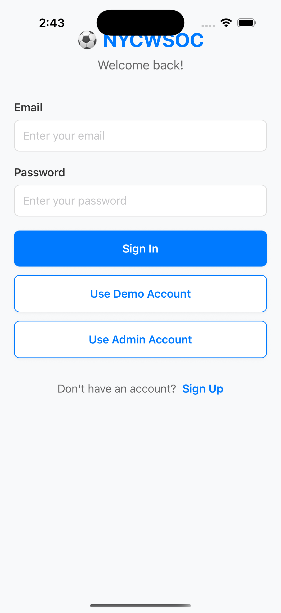

# React Native Soccer App

This is a vibe-coded MVP React Native iOS app for a [soccer league](https://www.nycwsoc.com/) I joined in NYC.

I created this app largely to gain experience with full-stack app development before trying more advanced personal project ideas.

Deployment costs $99/year on the App Store and a cloud-based data solution would also not be cheap, so I'm leaving this on GitHub for now until I refine the UI/UX well enough to potentially pitch it to the league.

## App feature description

To see all app features, read the [app's functionality documentation](docs/app_functionality.md).

## Development

### Prereq: Environment set-up

1. Make sure you have completed React Native's [Set Up Your Environment](https://reactnative.dev/docs/set-up-your-environment) guide before proceeding.
1. Adhere to this repo's [system requirements guide](docs/system_requirements.md).

### Building and running the iOS app

1. Follow the [building and running instructions](docs/building_and_running.md) to build and run the app from just 1 simple Bash script

## Future Work

Before distributing, I'd like to accomplish:

1. password authentication
1. cloud database deployment
1. UI/UX clean-up
1. iron out few lingering navigational bugs
1. replace dummy data with real-life data from the league
1. add registration Google form that the actual league uses right now
1. enable the CSV export in the Admin dashboard to export to a compatible format on the iPhone
1. fix the UI to also look good in web-view
1. verify that the notification reminder system works correctly